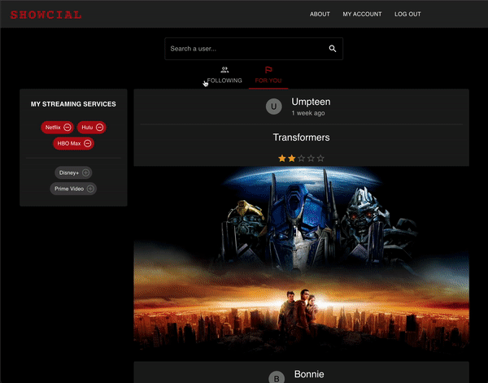

# Welcome to Showcial! The best site for finding movies and shows based on your friends recommendations and ratings!


## Authored by:

-  [Shengnan Huang](https://github.com/maomaotuo)
-  [Kiki Cai](https://github.com/caixiuqi2013)
-  [Kevin On](https://github.com/kanokawn)
-  [Cristian Ordonez](https://github.com/cristianordonez)
-  [Tyler Nourse](https://github.com/Nourse41)
-  [Josh Waalkes](https://github.com/WaalkesJoshua)

# Introduction

This project was completed over the course of a month, where our team wrote a full stack application for Bonnie Owens and Joe Casey. We met with Bonnie and Joe August 20th, 2022 for a project proposal. One week later we met with them again to present our application wireframes and to review the project proposal. At this point, we recieved some change requests to improve user experience. At our next client meeting, the functioning application was happily approved and from there we spent the remainder of the project styling and fixing minor bugs.

## Features & Usage Demo

https://user-images.githubusercontent.com/93630511/189451292-ae04fda5-03d9-401c-8e51-90c76c8668da.mp4


-  Users can choose media type of recommended videos, by clicking the image of each video, users can get detail of the video. Also users can interact with other users by recommending the video, rating the video, and adding the video to watch list


-  Users are given the option of logging in with google or signing in with a username and password


-  Users can view trending videos from other users by swiping through a carousel of all trending movies
-  Showcial allows users to share/review movies and shows
-  User followers can then see the 'activity' of the user and find reviews and reccomendations that matter to them, not just some online critic's two cents.

   

-  Users can create their own watch list
-  Filtering allows users to see only movies and shows they own services for such as Netflix, Hulu, Disney+, HBO Max, and Prime Video.
    

-  Search functionality allows users to find movies and tv shows by name as well as friends to follow.
-  Users can also explore the site without creating an account, however, to use most of the personalized features, they will need to login.


-  Users can view their own personal profile to see an expandable/collapsable stream of activities from the people they follow.
-  A clickable “My Streaming Service” component allows users to add or remove owned services from their profiles.


- While in a personal profile, users have the ability to click on any of the users in their activity feed to view that person’s activities or watch list, and to follow or unfollow them.


- Users can navigate to a “Following Page” that displays a list of the users they follow with the ability to unfollow them or click and view that person's profile.
- Search can use the search bar to find and navigate to any other user’s profile.

## Tech Stack

This project was built with the following technologies:


## Challenges

### Anticipated

-  Styling with MUI components was difficult at first but with persistent research we were able to create a visually appealing site.

### Unexpected

-  Using Passport.js for local authentication was difficult due to poorly written documentation. Instead we created our own authentication system to handle username and password and used Passport.js for google authentication.

## Setup/ Installation

-  Clone this repository and navigate to project directory in the terminal
-  Install necessary dependencies:

```bash
npm install
```

-  Create a client/dist directory and a index.html file for webpack to output content to.
-  Create .env file to store environment variables based on sample (.env is already present in .gitignore to prevent revealing private keys)
-  Make sure all express server routes begin with '/api'
-  Then, if environment is set to development, run the application like so:

```bash
npm run dev
```

This opens a development server in your local browser at port 3000.

-  When application is ready for production, have webpack build your bundle and minimize your files and then start the Express server (NOTE: To allow code-splitting to work when building files, must first change tsconfig.json 'module' variable to 'esnext'. Feel free to change back to 'commonjs' after building files to avoid errors with using import statements instead of require statements for modules.):

```bash
npm run build
npm start
```

Then navigate to port 8080 in your browser to view your application.

## Testing

-  Run unit tests with Jest/React Testing Library:

```bash
npm run jest
```

-Then run end to end tests with Cypress:

```bash
npm run cypress
```

-Or run both tests concurrently:

```bash
npm run test
```

## Resources

-  [React](https://reactjs.org/)
-  [webpack](https://webpack.js.org/)
-  [Babel](https://babeljs.io/)
-  [Prettier](https://prettier.io/)
-  [Cypress](https://www.cypress.io/)
-  [Jest](https://jestjs.io/docs/getting-started)
